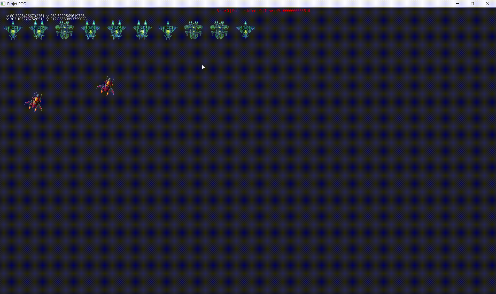

# Fiche rendu projet
<!-- Ce document est un bilan destiné au client. Présentez ce qui a été livré, ce qui fonctionne, et tournez habilement ce qui manque. Pas de jargon technique — on parle de fonctionnalités et de valeur perçue.-->
## Rappel du projet

<!-- Reprenez brièvement le pitch initial. Qu'aviez-vous promis ? -->

Initialement, le jeu voulu, devait permettre à 1 ou 2 joueurs de contrôler un vaisseau dans un espace en deux dimensions avec les touches ZQSD ou/et flèches directionnelles.
Ils évoluent dans les 3/4 inférieurs de la fenêtre, tandis que les ennemis apparaissent dans le quart supérieur de la fenêtre.
Ils peuvent avancer, reculer, tourner à gauche, à droite. Ces ennemis peuvent avoir différents comportements : certains tirent tout droit, et ou se déplacent aléatoirement, d'autres tirer plus vite, tirer plus de fois, target 2 joueurs à la fois, ...
De plus, les joueurs tirent dans la même direction que leur vaisseau se dirige. Cela inflige des dégâts d'une quantité définie au potentiel allié, et à l'ennemi.
Les joueurs peuvent débloquer des upgrades au bout d'un certain temps, et ainsi faire face aux ennemis plus difficiles.
Enfin, le jeu se finit dans le cas où tous les joueurs sont morts, ou lorsque la victoire est déclarée à la fin d'un certain temps.
Un tableau de score afficherait le score cumulé des joueurs, les upgrades qu'ils ont, ...
Des sons seraient joués lors d'événements, comme lorsqu'un tir est effectué, ou lorsqu'un ennemi est tué, ou qu'un joueur est tué, ...

## Ce qui a été livré

<!-- Présentez les fonctionnalités livrées. Captures d'écran / GIFs animés bienvenus. -->
<!-- Placez vos images dans docs/images/ et référencez-les avec :  -->

### Fonctionnalité 1 — *Contrôle de vaisseaux*

Un ou deux personnes sont bien capables de contrôler un vaisseau dans un espace en deux dimensions avec les touches ZQSD ou/et flèches directionnelles.
Tenez-vous prêts à affronter l'ennemi ! 

### Fonctionnalité 2 — *Tir automatique des vaisseaux alliés*

Les vaisseaux contrôlés par les joueurs tirent automatiquement des projectiles dans la direction même du vaisseau, à intervalle régulier. 

### Fonctionnalité 3 — *Spawn d'ennemis*

Des ennemis apparaissent sur l'écran, prêt à affronter les vaisseaux alliés. 

### Fonctionnalité 4 — *Tableau de score et statistiques*

Les joueurs peuvent désormais consulter leur score ! Affichant le nombre d'ennemis tués, ou encore les upgrades débloquées, le temps écoulé, vous ne perdrez jamais de vue votre progression dans le jeu.

### Fonctionnalité 5 — *Sons dans le jeu*

Vous disposez d'une musique de fond entrainante dans le style du jeu, facilement modifiable à souhait ! De plus, les tirs d'alliés, d'ennemis, effectueront un son notable pour une meilleure expérience de jeu !

## Ce qui n'a pas été livré (et pourquoi)

<!-- Expliquez ce qui manque. Soyez malin : présentez les manques comme des opportunités futures, pas comme des échecs. -->

- Le système d'upgrades n'est pas encore disponible. La priorité a été donnée à l'aspect fonctionnel des interactions joueurs/ennemis. De plus, cela nous permettra de redéfinir correctement les upgrades à implémenter, en fonction de l'état actuel du jeu ! 
- Les ennemis ne sont pas encore capables de tirer et se déplacer en fonction de comportements définis. Nous avons préféré implémenter un système de spawn d'ennemis fonctionnel, pour ainsi pouvoir tester les interactions avec les joueurs, et ainsi mieux définir les comportements à implémenter pour les ennemis.
- La condition de fin de partie sera définie une fois le gameplay stabilisé — la définir maintenant sans avoir de données de test aurait été arbitraire et contre-productif.
- Les ennemis et alliés ne prennent pas encore de dégâts. Ce système est en développement actuel, nous considérons en fait la possibilité d'ajouter une mécanique de bouclier, pour ainsi différencier les dégâts pris et les dégâts infligés, et ainsi ajouter une dimension stratégique au jeu.

## Perspectives

Une des perspectives envisagées est d'ajouter un système de skins à notre jeu. Cela améliorera grandement l'expérience utilisateur.
De plus, un menu de jeu sonne comme la perspective évidente à implémenter. L'on y pourra sélectionner un pseudonyme, le skin de son vaisseau (mentionné précédemment), et d'autres customisations du jeu.
Un système de difficulté peut être implémenté. À la base, le jeu est prévu pour être joué à un ou deux face à des ennemis ayant un comportement prévu similaire pour toute partie. Cependant, il peut s'avérer logique de mettre en place des niveaux de difficulté facile, moyen, difficile.
Dans l'absolu, il serait intéressant d'implémenter le jeu en réseau. Des joueurs pourraient jouer ensemble à distance, comparer leurs scores à d'autres personnes, ...
