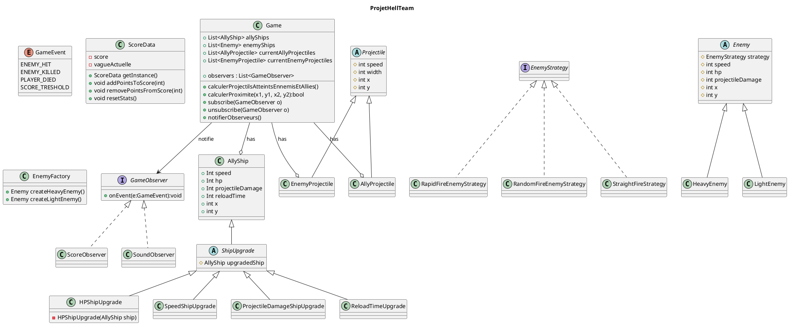
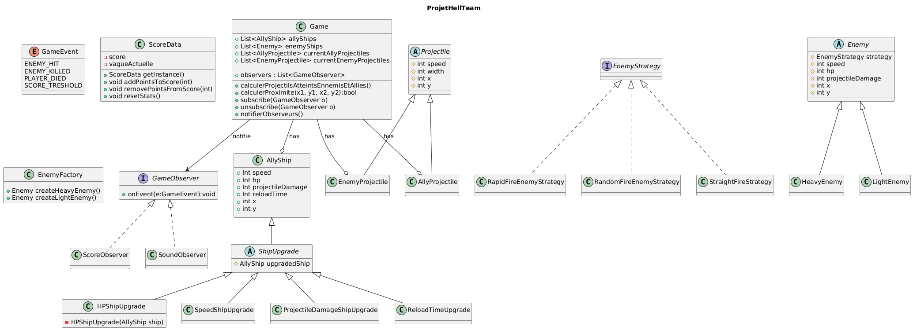
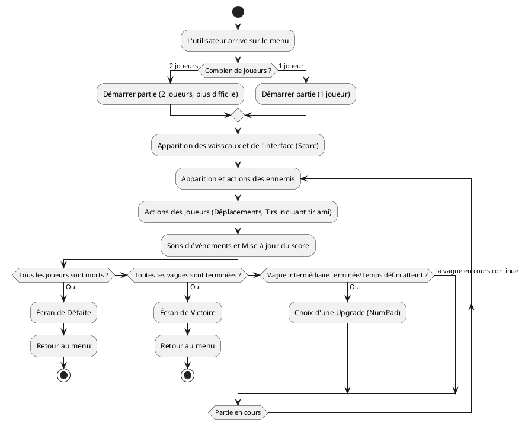
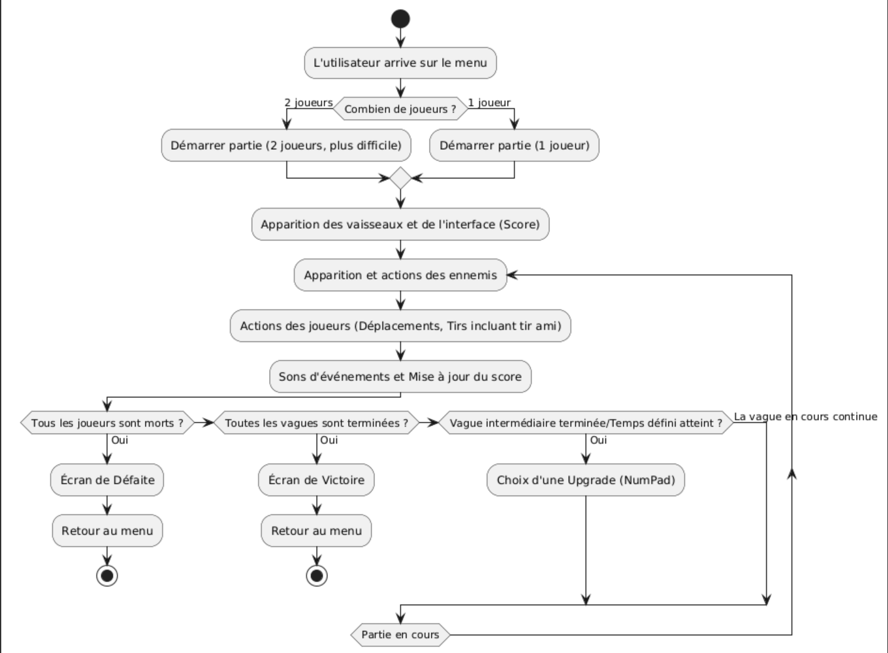

# Conception technique

> Ce document décrit l'architecture technique de votre projet. Vous êtes dans le rôle du lead-dev / architecte. C'est un document technique destiné à des développeurs.


```
- Factory pour créer les ennemis
- Pattern Decorateur permettant de rendre invincible, de tirer 2 fois plus vite, de faire autre chose temporairement...
- Singleton des stats qui augmente le score, ...
- Classe qui régit les power-ups (Strategy)
- Quand un ennemi est touché, un DP Observer fait un son
- Un ennemi a un attribut qui pointe vers une interface EnemyStrategy qui doit être implémenté par au moins 2 classes de strategy. L'implémentation est choisie au RunTime
```

## Vue d'ensemble

<!-- Décrivez les grandes briques de votre application et comment elles communiquent. Un schéma d'architecture est bienvenu. -->

## Design Patterns

### DP 1 — *Pattern Strategy* (implémenté dans le diagramme de classes)

**Feature associée** : Création des vaisseaux ennemis 

**Justification** : Lorsque le système crée un ennemi, on souhaite pouvoir définir avec un ennemi avec un comportement particulier ou un autre comportement, dans des classes Strategy isolant et définissant ce comportement.
Par exemple, on aura une interface Enemy Strategy qui pourra être implémentée par des classes BossStrategy qui l'implémentera (qui définira des stats boostées, des capacités à tirer plusieurs fois), ou une autre classe BasicEnemyStrategy (qui définira le comportement d'un vaisseau ennemi classique), ...

**Intégration** : 
<!-- Comment s'intègre-t-il dans l'architecture ? -->

### DP 2 — *Pattern Observer* 

**Feature associée** : Sons joués lors d'événements dans le jeu 

**Justification** : On souhaite pouvoir jouer des sons lorsqu'un ennemi est tué (voire touché), lorsque l'un des deux joueurs meurt, lorsqu'on atteint une jauge dans le score, ... L'intérêt ici est d'utiliser un Observer qui va être capable de détecter l'événement représentant la mort d'un ennemi, un ennemi touché, un allié mort, un score atteint, ...  

**Intégration** : 

### DP 3 — *Pattern Singleton* (implémenté dans le diagramme de classes)

**Feature associée** : Tableau de scores de la partie

**Justification** : Dans les fonctionnalités sont voulues un tableau de statistiques affichées sur l'écran. On n'a besoin de l'instancier qu'une fois, et les appels seront effectués à cette instance. Ainsi, on va utiliser une classe utilisant un DP Singleton qui disposera de méthodes pouvant être appellées pour lui envoyer des statistiques.

**Intégration** : 

### DP 4 — *Pattern Factory* (implémenté dans le diagramme de classes)

**Feature associée** : Création d'ennemis variés  

**Justification** : On a besoin d'un système permettant de créer facilement et rapidement de divers ennemis. Ainsi, on va créer une EnemyFactory, qui sera responsable de créer les ennemis en fonction de ce qui lui est demandé. Par exemple, une méthode dans la Factory qui renverra un boss, 

**Intégration** : 

### DP 5 - *Pattern Decorator* (quasiment implémenté dans le diagramme de classes)

**Feature associée** : Application d'upgrades par intermittence aux joueurs alliés

**Justification** : Sachant qu'on souhaite pouvoir ajouter de temps à autre des upgrades aux deux joueurs, on va utiliser un pattern Decorator dans ce sens. Il empilera les upgrades une par une, et les stats seront calculées conséquence.

**Intégration** :

## Diagrammes UML

### Diagramme 1 — *Classe*

Diagramme non terminé, mais un commentaire sera apprécié !




### Diagramme 2 — *Activité*


