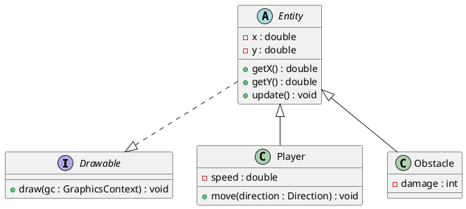

# Conception technique

> Ce document décrit l'architecture technique de votre projet. Vous êtes dans le rôle du lead-dev / architecte. C'est un document technique destiné à des développeurs.


Factory pour créer les ennemis
- Pattern Decorateur permettant de rendre invincible, de tirer 2 fois plus vite, de faire autre chose temporairement...
- Singleton des stats qui augmente le score, ...
- Classe qui régit les power-ups (Strategy)
- Quand un ennemi est touché, un DP Observer fait un son
- Un ennemi a un attribut qui pointe vers une interface EnemyStrategy qui doit être implémenté par au moins 2 classes de strategy. L'implémentation est choisie au RunTime


## Vue d'ensemble

<!-- Décrivez les grandes briques de votre application et comment elles communiquent. Un schéma d'architecture est bienvenu. -->

## Design Patterns

### DP 1 — *Nom du pattern*

**Feature associée** : 

**Justification** : 
<!-- Pourquoi ce pattern ? Pourquoi pas un autre ? -->

**Intégration** : 
<!-- Comment s'intègre-t-il dans l'architecture ? -->

### DP 2 — *Nom du pattern*

**Feature associée** : 

**Justification** : 

**Intégration** : 

### DP 3 — *Nom du pattern*

**Feature associée** : 

**Justification** : 

**Intégration** : 

### DP 4 — *Nom du pattern*

**Feature associée** : 

**Justification** : 

**Intégration** : 

## Diagrammes UML

### Diagramme 1 — *Type (classe, séquence, cas d'utilisation…)*

<!-- Exemple de syntaxe PlantUML (à remplacer par votre diagramme) :



Ceci est un exemple, remplacez-le par votre propre diagramme. -->

```plantuml
@startuml

@enduml
```

### Diagramme 2 — *Type*

```plantuml
@startuml

@enduml
```

