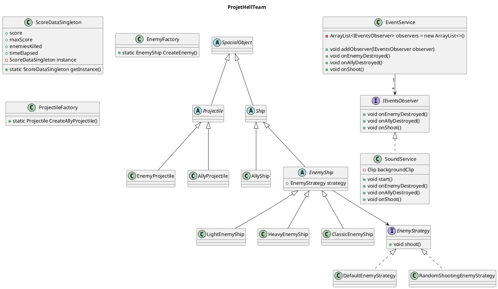
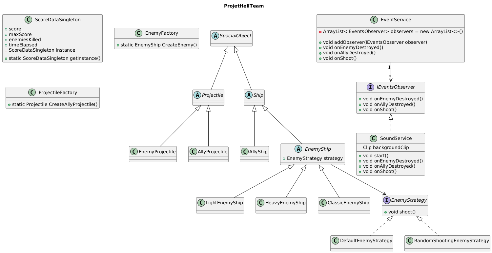

# Document de réversibilité technique

<!--Ce document est destiné à l'équipe qui reprendra la maintenance du projet. Soyez honnêtes et exhaustifs. Pas d'enjolivement.-->

## Architecture actuelle

<!-- Diagramme de classes ou de composants reflétant l'état RÉEL du code (pas la conception initiale). -->

## Bugs connus

<!-- Listez tous les bugs identifiés, même mineurs. Précisez les conditions de reproduction. -->

| Bug                                                                                                                     | Sévérité   | Conditions de reproduction                                                                                       | Comment régler le bug                                                                                               |
|-------------------------------------------------------------------------------------------------------------------------|------------|------------------------------------------------------------------------------------------------------------------|---------------------------------------------------------------------------------------------------------------------|
| Les vaisseaux, alliés ou ennemis peuvent sortir hors de l'interface, et évoluer ainsi à l'extérieur de la zone prévue   | Moyenne    | Déplacer les vaisseaux alliés avec les flèches directionnelles, ou déplacer les ennemis selon la logique de code | Faire en sorte que la position des vaisseaux soit calculée et ainsi bloquer le vaisseau à la position de la bordure |
| Trop d'entités ralentissent voire font crasher le jeu                                                                   | Elevée     | Provoquer un nombre de projectiles/ennemis très élevé à la seconde / / faire durer le jeu trop longtemps pour X raison                                             | Supprimer les projectiles étant passés en dehors de l'interface visible |

## Limitations techniques

<!-- Ce qui ne fonctionne pas ou fonctionne partiellement. -->
- Pas de gestion de collision entre les projectiles et les vaisseaux, ni de gestion de dégâts.
- Pas de système d'upgrades pour les vaisseaux alliés.
- Pas de tirs d'ennemis.
- Pas de comportements d'ennemis définis
- Pas de gestion des limites de l'interface pour les vaisseaux alliés et ennemis.
- Pas de condition de fin de partie définie.
- Pas de score évoluant en fonction des actions du joueur (implémenté, mais pas fonctionnel)

## Points de vigilance pour la reprise

<!-- Ce qu'un développeur reprenant le projet doit absolument savoir. -->

- Si volonté d'implémenter un pattern décorateur pour les upgrades (prévu au départ), considérer la possibilité d'un important refactoring du code au niveau des classes AllyShip et EnemyShip.
- Prévoir rapidement la mise en place d'un menu stable de jeu permettant de sélectionner les options, pour éviter de devoir modifier toute la logique au lancement du jeu.
- Le pattern Strategy a déja la base implémentée dans le code. Implémenté, mais pas fonctionnel. Il est nécessaire de viser prioritairement à le rendre fonctionnel, pour ainsi pouvoir implémenter les différents comportements d'ennemis prévus.

## Améliorations recommandées

| Amélioration                                                                                                                              | Difficulté | Justification                                                            |
|-------------------------------------------------------------------------------------------------------------------------------------------|-----------|--------------------------------------------------------------------------|
| Mise en place d'un menu                                                                                                                   | Moyen     | Configuration facile des options (au lieu du random pour 1 ou 2 joueurs) |
| Calcul de la position avec blocage en conséquence                                                                                         | Facile    | Eviter une sortie d'interface                                            |
| Mettre en place un algorithme/IA pour un fonctionnement complexe des ennemis                                                              | Complexe  | Rendre cohérentes les actions ennemies                                   |
| Empêcher la collision entre deux vaisseaux alliés en fonction d'une certaine limite autour de leurs coordonées x,y                        | Moyen     | Rendre plus cohérent les collisions alliées                              |
| Mettre en place une accélération (bouton appuyé) impliquant vitesse max et décélération (bouton relaché) pour les alliés voir les ennemis | Moyen     | Mouvement plus fluide et naturel                                         |

## Points supplémentaires :  

- Ayant bien fonctionné :
    - Mise en place des mouvements du vaisseau
    - Tir automatique toutes les secondes
- Nous étions ambitieux sur les fonctionnalités : système en théorie complexe de générations d'ennemis pouvant impliquer des comportements délicats à implémenter (gérer le déplacement déterministe, aléatoire, plus le tir, aurait impliqué un système important pour que le déroulement du jeu ait du sens), et autre gestion des collisions.
- Etant un jeu impliquant du mouvement, de la gestion de position à toutes les frames, etc... Le développement a été focalisé sur les classes métiers. Les factory sont par exemple globalement fonctionnelles, mais pas utilisées à leur plein potentiel pour spawn des vaisseaux sur l'interface graphique.