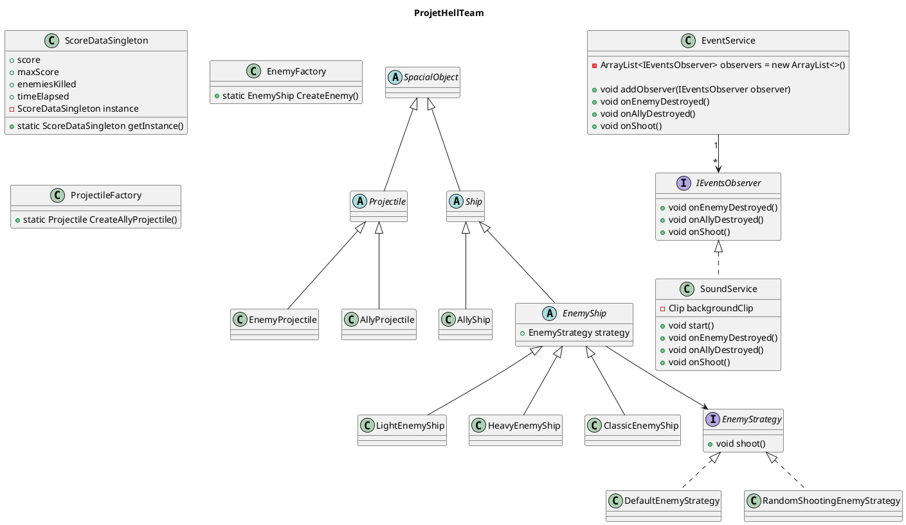

# Document de réversibilité technique

> Ce document est destiné à l'équipe qui reprendra la maintenance du projet. Soyez honnêtes et exhaustifs. Pas d'enjolivement.

## Architecture actuelle

<!-- Diagramme de classes ou de composants reflétant l'état RÉEL du code (pas la conception initiale). -->

## Bugs connus

<!-- Listez tous les bugs identifiés, même mineurs. Précisez les conditions de reproduction. -->

| Bug                                                                                                                     | Sévérité   | Conditions de reproduction                                                                                         |
|-------------------------------------------------------------------------------------------------------------------------|------------|--------------------------------------------------------------------------------------------------------------------|
| Les vaisseaux, alliés ou ennemis peuvent sortir hors de l'interface, et évoluer ainsi à l'extérieur de la zone prévue   | Moyenne    | Déplacer les vaisseaux alliés avec les flèches directionnelles, ou déplacer les ennemis selon la logique de code   |
| ----------------------------------------------------------------------------------------------------------------------- | ---------- | ------------------------------------------------------------------------------------------------------------------ |
| Trop d'entités ralentissent voire font crasher le jeu                                                                   | Elevée     | Provoquer un nombre de projectiles/ennemis très élevé à la seconde                                                 |

## Limitations techniques

<!-- Ce qui ne fonctionne pas ou fonctionne partiellement. -->

## Points de vigilance pour la reprise

<!-- Ce qu'un développeur reprenant le projet doit absolument savoir. -->

- Si volonté d'implémenter un pattern décorateur pour les upgrades (prévu au départ), considérer la possibilité d'un important refactoring du code au niveau des classes AllyShip et EnemyShip.
- Prévoir rapidement la mise en place d'un menu stable de jeu permettant de sélectionner les options, pour éviter de devoir modifier toute la logique au lancement du jeu.
- Le pattern Strategy a déja la base implémentée dans le code. Implémenté, mais pas fonctionnel. Il est nécessaire de viser prioritairement à le rendre fonctionnel, pour ainsi pouvoir implémenter les différents comportements d'ennemis prévus.

## Améliorations recommandées

| Amélioration | Difficulté | Justification |
|--------------|------------|---------------|
|              | Facile / Moyen / Complexe |   |

